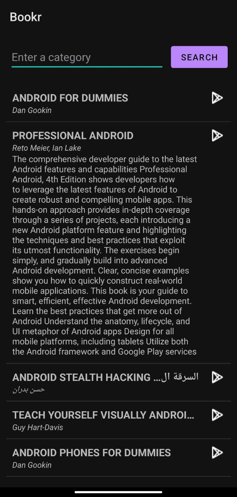

# Bookr App
## About
A capstone project for the [***Android Basics: Networking***](https://classroom.udacity.com/courses/ud843) course meant to practice the application of the follow concepts in Java Android:
- Fetching data from an API
- Using an AsyncTask
- Parsing a JSON response
- Creating a list based on that data and displaying it to the user.
- Using the Google Books API

## Features
- Search for a specific category of books
- View information about a book (title, authors, description)
- View the book on Goole Book Store

## Screenshots
